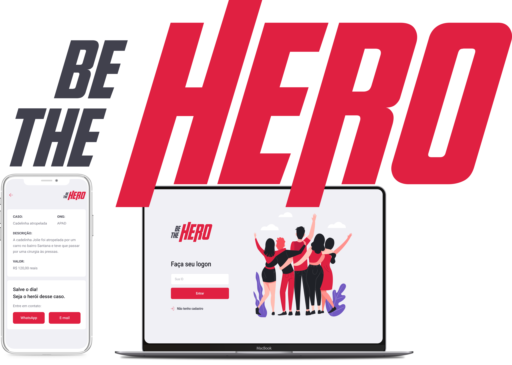

<p align="center">
  
  
  <p align="center">
  App to help NGOs built with ReactJS, React Native, Node.js and more.
  </p>

  

  > This project was made for learning purposes only and comes from Rocketseat's omnistack week crash course #11 with my own modifications
</p>

# App
[Website](https://.   COMPLETAR AQUI netlify.com/)

[Server](https:// COMPLETAR AQUI .herokuapp.com/ AQUI TAMBÉM )

## Download
<a href="git@github.com:jorgecardosorabello/be-the-hero-app.git"></a>

# Development setup

> yarn is required

After cloning this repo:
### Server 
  - Run ```npm``` in the ```backend``` folder
  - Go back to the root folder
  - Run ```npm start``` to up the server
  - Open ```Insomnia``` or ```Postman``` and import the ```Insomnia.json``` workspace file at ```backend``` folder
### Website
  - Run ```npm``` in the ```frontend``` folder
  - Go back to the root folder
  - Run ```npm start``` to up the project
### Mobile
  - Run ```npm``` in the ```mobile``` folder
  - Update the ```baseURL``` at ```src/config/index.js```
  - Go back to the root folder
  - Run ```npm start``` to up the project

# Tests
### Server
  - Run ```npm test:server``` at the root folder
  
